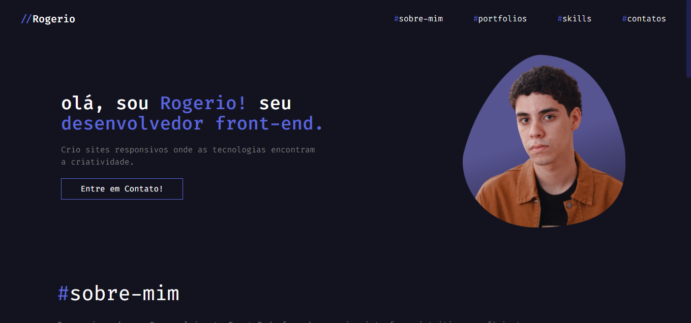

# 🌟 Portfólio | Rogerio Cardoso Junior

🚀 Bem-vindo ao meu portfólio! Aqui você encontra informações sobre este projeto e tecnologias que utilizei

## 🖥️ Sobre o Projeto

Este portfólio foi criado para apresentar minha experiência e meus trabalhos como desenvolvedor Front-End. Utilizei tecnologias modernas para proporcionar uma experiência interativa e responsiva.

### 🔧 Tecnologias Utilizadas

- **React.js** ⚛️
- **Tailwind CSS** 🎨
- **JavaScript (ES6+)** ✨
- **HTML5 & CSS3** 📄

## 📸 Captura de Tela

> 
  

## 🌍 Deploy

O portfólio está disponível online! Você pode acessá-lo aqui:  
🔗 **[Meu Portfólio]([https://meuportfolio.vercel.app/](https://portfolio-rogerio-cardoso.netlify.app/))** 

## 📬 Contato

💼 **Nome:** Rogerio Cardoso Junior  
📧 **Email:** [rcjunior018@gmail.com](mailto:rcjunior018@gmail.com)  
🔗 **LinkedIn:**   
